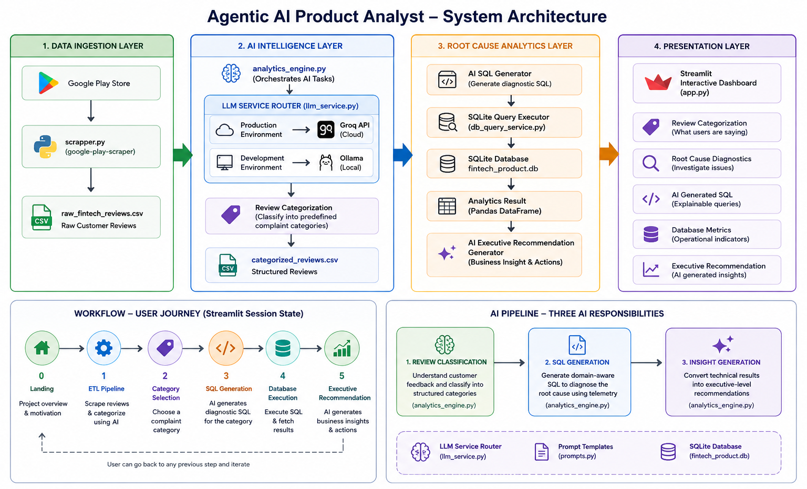

# 🤖 Agentic AI Product Analyst

**Live Playing Ground:** *https://agentic-ai-analyst.streamlit.app/* 
**Video Walkthrough:** *(Add LinkedIn/YouTube link)*

An AI-powered Copilot that automates product triage. It transforms thousands of unstructured customer complaints into deterministic SQL queries, cross-references them with backend telemetry, and generates C-suite engineering insights.

---

## 📌 The Problem & Solution

Product teams receive thousands of app store reviews daily, but manually correlating a user's front-end complaint (e.g., "the app is slow") with actual backend telemetry (e.g., latency spikes, API timeouts) takes days of cross-departmental effort.

**The Agentic AI Product Analyst** automates this entire pipeline. Instead of relying on sentiment analysis, this system:

1. **Ingests** raw Google Play Store reviews.
2. **Classifies** them into strict engineering categories using an LLM.
3. **Translates** those categories into executable SQLite queries.
4. **Validates** the complaints against synthetic backend telemetry.
5. **Generates** a boardroom-ready diagnostic summary based on hard data.

## 🏗️ System Architecture

The application is built on a highly modular, decoupled architecture, separating data ingestion, AI reasoning, database execution, and presentation.

<p align="center">
  
</p>

### 🧠 Core Engineering Highlights (Challenges Solved)

Instead of a standard CRUD app, this project tackles specific challenges inherent to working with Generative AI in production environments:

* **Hybrid LLM Routing (Cloud + Local):** Designed a centralized router (`llm_service.py`) that defaults to the **Groq API (Llama 3)** for ultra-low latency cloud inference, but automatically falls back to a fully local **Ollama** instance if no API key is detected.
* **Taming LLM Hallucinations:** AI-generated SQL is notoriously fragile. Implemented strict prompt engineering constraints and regex-based extraction layers to isolate executable JSON and SQL, stripping out conversational markdown before execution.
* **Data-Grounded Recommendations:** To prevent the AI from generating opinions, the final executive summary is only generated *after* the AI's SQL query is successfully executed against the `fintech_product.db`. Insights are strictly grounded in measured telemetry.
* **State-Driven UI Orchestration:** Built a multi-stage ETL and diagnostic workflow in Streamlit. Leveraged advanced `st.session_state` management to prevent UI rendering loops and preserve data across component re-runs.

## 🛠️ Tech Stack

| Technology | Implementation Purpose |
| --- | --- |
| **Python** | Core backend logic and pipeline orchestration. |
| **Streamlit** | Interactive, state-driven front-end dashboard. |
| **Groq API / Ollama** | Cloud (Llama 3) and Local LLM inference engines. |
| **SQLite** | Highly-normalized synthetic database simulating backend telemetry. |
| **Pandas & Plotly** | Data aggregation, transformation, and dynamic visualization. |
| **google-play-scraper** | Real-world data ingestion pipeline. |

## 📁 Project Structure

```text
Agentic-AI-Product-Analyst/
├── app.py                   # Streamlit UI & State Management
├── analytics_engine.py      # Core AI logic (classification, SQL gen, insights)
├── llm_service.py           # Environment-aware Groq/Ollama router
├── prompts.py               # Prompt templates & firewall constraints
├── db_query_service.py      # Secure SQLite execution layer
├── build_database.py        # Synthetic telemetry database generator
├── scrapper.py              # App Store ingestion script
│
├── fintech_product.db       # Generated SQLite database
├── raw_fintech_reviews.csv  # Input dataset
├── categorized_reviews.csv  # Processed dataset (Demo Mode)

```

## 🚀 Getting Started

### 1️⃣ Installation

```bash
git clone https://github.com/<your-username>/Agentic-AI-Product-Analyst.git
cd Agentic-AI-Product-Analyst

python -m venv .venv
# Activate: `.venv\Scripts\activate` (Windows) or `source .venv/bin/activate` (Mac/Linux)

pip install -r requirements.txt

```

### 2️⃣ Option A: Cloud Inference via Groq (Fastest)

Set your environment variable and launch. The app will automatically detect the key and route to Groq.

```bash
# Windows (Command Prompt)
set GROQ_API_KEY=your_api_key_here
# Mac/Linux
export GROQ_API_KEY=your_api_key_here

streamlit run app.py

```

### 3️⃣ Option B: Local Inference via Ollama (Offline)

Ensure [Ollama](https://ollama.com) is installed and the model is pulled (`ollama pull llama3`). Run the app without setting an API key, and the system will automatically route to your local hardware.

```bash
streamlit run app.py

```

## 🔮 Future Roadmap

* **Database Migration:** Upgrade SQLite to PostgreSQL to support larger concurrent analytical workloads.
* **RAG Integration:** Introduce Retrieval-Augmented Generation to cross-reference customer complaints with internal Jira tickets and incident post-mortems.
* **Streaming Telemetry:** Shift from static CSV ingestion to an event-driven architecture handling real-time review streams.

## 👨‍💻 Author

**Anshu Kumar Gupta**

* 🎓 B.Tech, Computer Science & Engineering, NIT Arunachal Pradesh
* 💻 GitHub: *https://github.com/anshuprojectbill986295*
* 💼 LinkedIn: *https://www.linkedin.com/in/anshu9862*